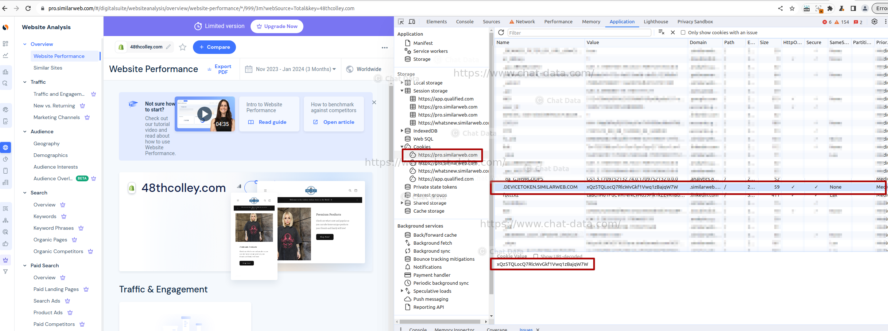
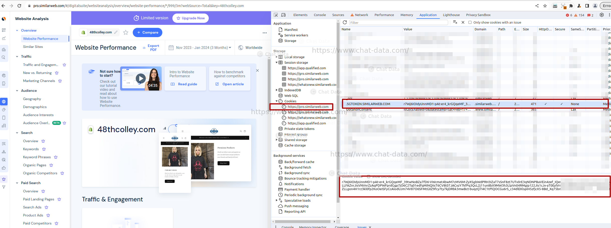

# Shopify Store Traffic API (Unofficial)

We developed this unofficial API in conjunction with our innovative Shopify store AI chatbot service, designed to transform Shopify stores into GPT-powered storefronts capable of selling products and managing customer services autonomously. For an in-depth understanding, we recommend our [Step-by-Step Guide to Building an AI Customer Support Chatbot for Your Shopify Store Without Code](https://www.chat-data.com/blog/step-by-step-guide-to-building-an-ai-customer-support-chatbot-for-your-shopify-store-without-code).

Our marketing strategy's initial step involves targeting the largest Shopify stores, identified by their significant traffic volumes, as they represent the most promising prospective customers for our products. After acquiring a list of 10,000 Shopify store domains, we discovered that many were either inactive or attracted negligible traffic, making individual outreach impractical. Consequently, we developed an API to automatically assess store traffic, enabling us to prioritize stores by their visitor counts. This open-source project enables anyone to freely evaluate the traffic of potential customer websites, thereby reducing the likelihood of sending emails to inactive or low-traffic sites that are unlikely to respond.

The primary output is the traffic-sorted file [data/stores_traffic.csv](./data/stores_traffic.csv). For demonstration, we've included 200 Shopify stores with moderate traffic levels. For access to a list of higher-traffic stores, please contact us at admin@chat-data.com.

## How to run the script

### 1. Clone the repo

```bash
git clone https://github.com/chat-data-llc/shopify_store_traffic_api.git
```

### 2. Install Dependencies

Open a terminal in the root directory of your local repository and run:

```bash
npm install
```

### 3. Set Up the Environment Variables

Register for a free account at [https://www.similarweb.com/](https://www.similarweb.com/) and obtain a token by entering a domain to check its traffic. Use Chrome's developer tools to navigate to the`Application`tab, select the `Cookies` sidebar, and find the following cookies at `https://pro.similarweb.com` These should be saved as environment variables:

- `DEVICETOKEN`: 



- `SGTOKEN`:




The environment variables can be specified within the `.env` file located at the root directory of the repository.

### 4. Shopify Stores List
Store domains should be listed line by line in [data/stores.list](./data/stores.list) file.  For demonstration purpose we only show 200 shopify stores which have some modest traffic. If you want the shopify store list which have higher traffic, please contact us at admin@chat-data.com.

### 5. Run the evaluate script

In the root directory of your local repository, run:

```bash
npm run start
```
Store traffic data will be saved in [data/stores_traffic.csv](./data/stores_traffic.csv).

## Conclusion

Although initially designed for Shopify store traffic analysis, this script can be adapted for any website's traffic assessment. The API's conceptual framework is also applicable in the development of other web-based APIs.

## Contact

[Chat Data LLC](admin@chat-data.com)
